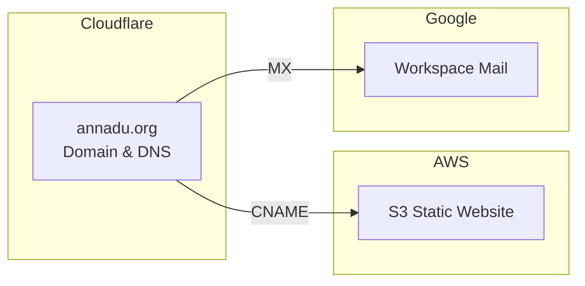
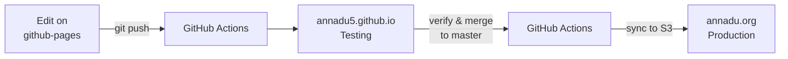

# annadu.org

Anna Du's personal [website](https://annadu.org) showcasing environmental science work and microplastics research.

## Project Structure

```
annadu.org/
├── docs/                    # Website files (served to production)
│   ├── index.html          # Main page
│   ├── js/app.js           # Content data (news, videos, research)
│   ├── js/main.js          # UI interactions
│   ├── css/style.css       # Custom styling
│   ├── img/                # Images
│   └── pdf/                # Documents (resume, awards)
├── archive/                 # Old website (archived)
└── .github/workflows/       # GitHub Actions deployment
```

## Updating Content

All dynamic content is in [docs/js/app.js](https://github.com/annadu5/annadu.org/blob/master/docs/js/app.js):
- News items
- Videos
- Competitions
- Research publications

Edit the corresponding data objects and follow the deployment workflow below.

## Infrastructure



- **Domain & DNS**: Cloudflare
- **Website Hosting**: AWS S3 static website
- **Email**: Google Workspace

## Deployment Workflow



1. **Develop** - Make changes on `github-pages` branch
2. **Test locally** - Open `docs/index.html` in a browser to verify changes
3. **Test remotely** - Push to `github-pages` triggers deployment to [testing site](https://annadu5.github.io/annadu.org/)
4. **Deploy** - Merge to `master` triggers sync to AWS S3, updating [annadu.org](https://annadu.org)

## Local Development

Open `docs/index.html` directly in a browser. No build tools required.

## Tech Stack

- Vue.js 3 (content rendering)
- Bootstrap (responsive layout)
- jQuery (UI interactions)
- AWS S3 (static hosting)
- GitHub Actions (CI/CD)
